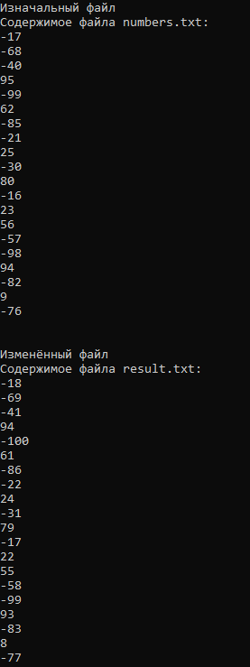
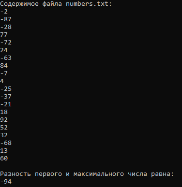
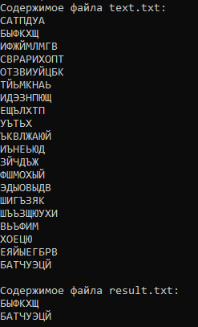
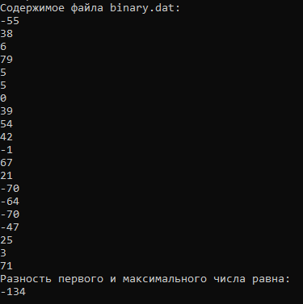
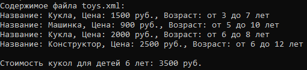
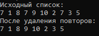
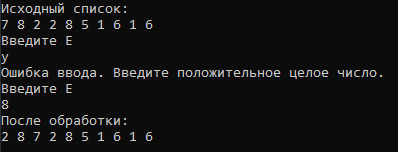
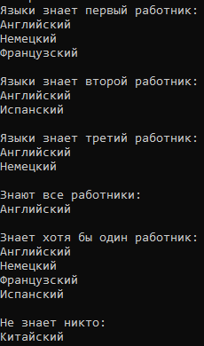

# Радостев Павел ИТС-2 Лабораторная №7

# Задание 1

## Задача 1

### Текст задачи
Получить новый файл, уменьшив каждый элемент исходного на 1

### Алгоритм решения
1. Создать текстовый файл и заполнить его случайными целыми числами
2. Открыть исходный файл для чтения
3. Создать новый файл для записи
4. Последовательно считать каждое число из исходного файла
5. Уменьшить считанное число на 1
6. Записать результат в новый файл
7. Закрыть файлы
8. Вывести содержимое исходного и результирующего файлов

### Тестирование

# Задание 2

## Задача 1

### Текст задачи
Найти разность первого и максимального элементов

### Алгоритм решения
1. Создать текстовый файл со случайными целыми числами
2. Считать первое число файла и сохранить его
3. Принять первое число за максимальное
4. Последовательно считать остальные числа файла
5. Если текущее число больше максимального, обновить значение максимума
6. После окончания чтения вычислить разность между первым и максимальным элементами
7. Вывести результат.

### Тестирование

# Задание 3

## Задача 1

### Текст задачи
В файле хранится произвольный текст. Переписать в другой файл строки, начинающиеся с буквы б

### Алгоритм решения
1. Создать текстовый файл со случайными строками
2. Открыть исходный файл для чтения
3. Создать результирующий файл для записи
4. Последовательно считать каждую строку
5. Проверить, начинается ли строка с буквы «б» или «Б»
6. Если условие выполняется, записать строку в новый файл
7. После обработки всех строк закрыть файлы
8. Вывести содержимое обоих файлов

### Тестирование

# Задание 4

## Задача 1

### Текст задачи
Найти разность первого и максимального элементов файла

### Алгоритм решения
1. Создать бинарный файл со случайными целыми числами
2. Считать первый элемент файла
3. Принять его за максимальный
4. Последовательно считать остальные элементы бинарного файла
5. Если очередной элемент больше максимального, обновить максимум
6. После завершения чтения вычислить разность первого и максимального элементов
7. Вывести результат

### Тестирование

# Задание 5

## Задача 1

### Текст задачи
Файл содержит сведения об игрушках: название игрушки, ее стоимость в рублях и возрастные границы (например, игрушка может предназначаться для детей от двух до пяти лет). Определить стоимость кукол для детей шести лет

### Алгоритм решения
1. Создать XML-файл со сведениями об игрушках
2. Выполнить десериализацию XML-файла в коллекцию объектов
3. Для каждой игрушки проверить:
    - название равно «Кукла»;
    - возраст 6 лет входит в диапазон допустимого возраста
6. Если оба условия выполняются, добавить стоимость игрушки к общей сумме
7. После обработки всех игрушек вывести итоговую стоимость

### Тестирование

# Задание 6

## Задача 1

### Текст задачи
Оставить в списке только первые вхождения одинаковых элементов

### Алгоритм решения
1. Создать список случайных целых чисел
2. Создать пустое множество уникальных элементов
3. Последовательно просматривать элементы списка
4. Если элемент встречается впервые, добавить его в множество
5. Если элемент уже присутствует в множестве, удалить его из списка
6. После завершения обработки вывести полученный список

### Тестирование

# Задание 7

## Задача 1

### Текст задачи
Если у элемента со значением E "соседи" не равны, поменять их местами

### Алгоритм решения
1. Создать двусвязный список случайных чисел
2. Найти узел со значением E
3. Проверить наличие левого и правого соседей
4. Если хотя бы одного соседа нет, завершить обработку
5. Сравнить значения соседних элементов
6. Если значения различаются, поменять их местами
7. Вывести изменённый список

### Тестирование

# Задание 8

## Задача 1

### Текст задачи
Есть перечень иностранных языков. Работники фирмы могут знать некоторые из них. Для каждого работника известно, какие языки он знает. Определить для каждого языка, какие из них знает каждый из работников, какие — хотя бы один из работников, и какие — никто из работников

### Алгоритм решения
1. Создать множество всех языков
2. Для каждого работника сформировать множество известных ему языков
3. Для нахождения языков, известных всем работникам:
    - выполнить пересечение множеств работников
4. Для нахождения языков, известных хотя бы одному работнику:
    - выполнить объединение множеств работников
5. Для нахождения языков, неизвестных никому:
    - из множества всех языков вычесть множество языков, известных хотя бы одному работнику
6. Вывести результаты

### Тестирование

# Задание 9

## Задача 1

### Текст задачи
Файл содержит текст на русском языке. С каких букв начинаются слова?

# Задание 10

## Задача 1

### Текст задачи
Имеется список учеников разных школ, сдававших экзамен по информатике, с указанием их фамилии, имени, школы и набранного балла. Напишите программу, которая будет определять двух учеников школы № 50, которые лучше всех сдали информатику, и выводить на экран их фамилии и имена.
Если наибольший балл набрали более двух человек, нужно вывести только их количество. Если наибольший балл набрал один человек, а следующий балл набрало несколько человек, нужно вывести только фамилию и имя лучшего. Известно, что информатику сдавали не менее 5 учеников школы № 50.
На вход программе в первой строке подается количество учеников списке N. В каждой из
последующих N строк находится информация в следующем формате:
<Фамилия><Имя><Школа><Балл>
где <Фамилия> – строка, состоящая не более, чем из 20 символов без пробелов, <Имя>– строка,
состоящая не более, чем из 20 символов без пробелов, <Школа> – целое число от 1 до 99, <Балл> –
целое число от 1 до 100.
Пример входной строки:
Иванов Сергей 50 87
Пример выходных данных, когда найдено два лучших:
Иванов Сергей
Сергеев Иван
Если больше двух учеников набрали высший балл, то программа должна вывести их количество.
Пример вывода в этом случае:
8
Если высший балл набрал один человек, а следующий балл набрало несколько человек, то программа должна вывести только фамилию и имя лучшего. Пример вывода в этом случае:
Иванов Сергей

### Алгоритм решения
1. Создать текстовый файл со сведениями об учениках
2. Считать данные файла в список объектов Student
3. Отобрать учеников школы № 50
4. Найти максимальный балл среди учеников данной школы
5. Определить количество учеников, набравших максимальный балл
6. Если максимальный балл набрали более двух учеников:
    - вывести их количество
7. Если максимальный балл набрали ровно два ученика:
    - вывести их фамилии и имена
8. Если максимальный балл набрал один ученик:
    - найти следующий по величине балл
    - определить количество учеников с этим баллом
    - если таких учеников несколько, вывести только фамилию и имя лучшего ученика
    - иначе вывести фамилии и имена двух лучших учеников

### Тестирование

